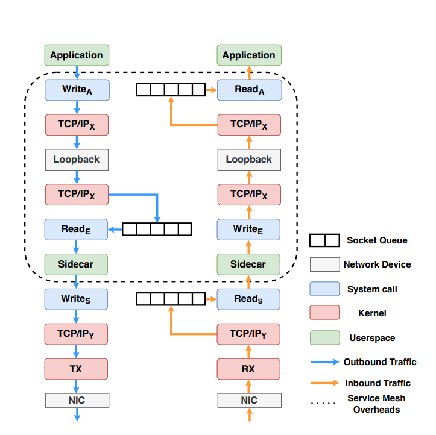

#  1. Improving Performance of Service Mesh for Cloud Native Applications- [Improving Performance of Service Mesh for Cloud Native Applications](#improving-performance-of-service-mesh-for-cloud-native-applications)
  - [Description](#description)
  - [Background Knowledge](#background-knowledge)

# 2. Description
Unlike traditional monolithic applications, cloud-native applications are the 
collection of small and independent services, which are so-called microservices. As cloud-native 
applications have gained tremendous interest in recent years, many cloud vendors such as Google 
Cloud and Amazon Web Service already provided cloud platforms for cloud-native applications.
Service meshes have been considered as a de facto communication subtrate for cloud-native 
applications. Specifcially, each service in a cloud-native application communicate to each other 
via a software proxy, called sidecar. A sidecar intercepts cloud traffic reaching a service and thus 
provides various control functions such as security and traffic management. However, as each 
sidecar is co-located with each service, this design introduces overhead (e.g., increasing latency 
and lower throughput) for cloud-native applications, especially for applications that include a 
significant number of services. This work aims to improve the performance of service mesh for 
cloud-native applications.

# 3. Background Knowledge
## Istio Envoy
Istio uses an extended version of the Envoy proxy. Envoy is a high-performance proxy developed in C++ to mediate all inbound and outbound traffic for all services in the service mesh. Envoy proxies are the only Istio components that interact with data plane traffic.Envoy is a high-performance proxy developed in C++ with built-in service discovery, load balancing, TLS termination, HTTP/2, GRPC proxy, fuse, health check, grayscale publishing based on percentage traffic splitting, fault injection, and more.

We start with a sample tutorial from `bookinfo` to analyze the envoy component.
- Bookinfo application has been successfully deployed and can be accessed via ip and port:
``` bash
$ echo "INGRESS_HOST=$INGRESS_HOST, INGRESS_PORT=$INGRESS_PORT"
INGRESS_HOST=10.0.0.5, INGRESS_PORT=30458
# Here the Ingress gateway uses NodeIP as the gateway

$ curl -s "http://${GATEWAY_URL}/productpage" | grep -o "<title>.*</title>"
<title>Simple Bookstore App</title>
```
The architecture of Bookinfo is as follows:
<div aligh=center></div>

Take Productpage as an example, there are two types of Containers, `Init Containers` and `Contianers`
The `Init container` is a specialized container that runs before the application container starts and is used to contain utilities or installation scripts that do not exist in the application image. Multiple Init containers can be specified in a Pod, and if more than one is specified, then the Init containers will run sequentially. The Init container will automatically terminate when it is finished, and Kubernetes will run the application container only when all Init containers have finished running.

```bash
$ kubectl describe pods productpage-v1-74fdfbd7c7-fpbmd 
# Init Containers
Args:
 istio-iptables
      -p
      15001
      -z
      15006
      -u
      1337
      -m
      REDIRECT
      -i
      *
      -x
      
      -b
      *
      -d
      15090,15021,15020
```
This startup command does the following.
- Forward all traffic from the container to Envoy's port 15001.
- Run as the istio-proxy user with UID 1337.
- Redirects traffic using the default REDIRECT mode.
- Redirect all outbound traffic to Envoy proxy.
- Without port 15090,15021,15020

The last thing Envoy controls is the IP-Table.
Data flow diagram of the application in the TCP/IP stack
<div aligh=center></div>

The most commonly used basic firewall software in Linux is called iptables. iptables firewall works by interacting with packet filtering hooks in the Linux kernel's network stack. These kernel hooks are called the netfilter framework.

Each packet entering the network system (incoming or outgoing) triggers these hooks as it advances through the stack, allowing programs registered to these hooks to interact with traffic at critical points. The kernel modules associated with these modules of iptables register at these hooks to ensure that the traffic conforms to the conditions set by the firewall rules.

```bash
# master node iptable:
Chain OUTPUT (policy ACCEPT)
target     prot opt source               destination         
KUBE-SERVICES  all  --  0.0.0.0/0            0.0.0.0/0            ctstate NEW /* kubernetes service portals */
KUBE-FIREWALL  all  --  0.0.0.0/0            0.0.0.0/0 

# KUBE-FIREWALL ex.
Chain KUBE-FIREWALL (2 references)
target     prot opt source               destination         
DROP       all  --  0.0.0.0/0            0.0.0.0/0            /* kubernetes firewall for dropping marked packets */ mark match 0x8000/0x8000
DROP       all  -- !127.0.0.0/8          127.0.0.0/8          /* block incoming localnet connections */ ! ctstate RELATED,ESTABLISHED,DNAT
```
[More Info about IP-Tables](https://cloud.tencent.com/developer/article/1619659)
[Envoy Code Analyse](https://blog.csdn.net/wyy4045/article/details/119111541)
[Envoy Code Sturcture](https://cloud.tencent.com/developer/article/1554609#:~:text=%E8%BF%9B%E7%A8%8B%E6%97%A0%E5%85%B3%E6%9E%B6%E6%9E%84%20Envoy%20%E6%98%AF%E4%B8%80%E4%B8%AA%E8%87%AA%E7%BB%84%E7%BB%87%E7%9A%84%E6%A8%A1%E5%9D%97%EF%BC%8C%E4%B8%8E%E5%BA%94%E7%94%A8%20Server%20%E5%B9%B6%E6%97%A0%E7%9B%B4%E6%8E%A5%E4%BE%9D%E8%B5%96%E3%80%82%20%E6%89%80%E6%9C%89%E7%9A%84,Envoy%20%E6%9E%84%E5%BB%BA%E4%BA%86%E4%B8%80%E4%B8%AA%E9%80%8F%E6%98%8E%E7%9A%84%E6%9C%8D%E5%8A%A1%E7%BD%91%E6%A0%BC%20Service%20Mesh%20%EF%BC%8C%E5%A4%84%E4%BA%8E%E5%85%B6%E4%B8%AD%E7%9A%84%E5%BA%94%E7%94%A8%E5%8F%AA%E9%9C%80%E8%A6%81%E7%AE%80%E5%8D%95%E7%9A%84%E4%B8%8E%E6%9C%AC%E5%9C%B0%E7%9A%84%20Envoy%20%E8%BF%9B%E8%A1%8C%E6%94%B6%E5%8F%91%E4%BF%A1%E6%81%AF%EF%BC%8C%E5%B9%B6%E4%B8%8D%E9%9C%80%E8%A6%81%E5%85%B3%E6%B3%A8%E6%95%B4%E4%B8%AA%E7%BD%91%E7%BB%9C%E6%8B%93%E6%89%91%E3%80%82)

In Kubernetes, Pods are actually a concept that the Kubernetes project abstracts for you as an analogous process group; the Container managed by Pods runs the real processes within the program, and Envoy is also a single-process, multi-threaded project, so the communication between Envoy and Pods can actually be understood as Inter-process communication.

## Future Work
Thesis in ignoring the Protocol Parsing, IPC communication, data copy between user state and kernel state is the focus between the impact Latency.
### IPC Socket & Share Buffer
Combined with the relationship between Pod and Envoy, I think IPC communication can be used in general with IPC Socket, Shared memory. Optimization direction can be developed from these two directions.

Both can replace tcp/ip, ignore frequent kernel and user state switching, and shared memory combined with semaphores can handle very high concurrency, for example in the storage underlay of databases, where shared memory is also widely used.

### EBPF
[Reference 3 in paper](https://events.istio.io/istiocon-2021/sessions/accelerate-istio-cni-with-ebpf/) mentioned that ebpf also can speed up. Over the last two years, eBPF has become a technology trend and many eBPF-based projects have been released to the community. Tools like Cilium and Pixie demonstrate a large number of use cases for eBPF in terms of observability and network packet processing. With the sockops and redir features of eBPF, packets can be efficiently processed by transferring directly from the ingress socket to the egress socket. In Istio mesh, eBPF can be used to replace iptables rules and speed up the data plane by shortening the data path.


###  Intel Data Direct I/O technology
[DDIO Info(chinese)](https://blog.csdn.net/qq_40500045/article/details/109272627)

Change Protocol to RDMA or DPDK

### Load Balancer change
single modern switching ASIC

## Question
**IN PAPER**:For small message sizes that are common to microservice workloads, the additional system calls in implementation negate the savings from avoiding the copy operation. 

**I don't know why there, Conflict with Table 2 in Paper**


## MeshInSight
Exsample 1 Online Result
```bash
trace.json, (average) latency overhead: 270.61650124895914 us, cpu overhead: 190796.79702552065 virtual cores
```

