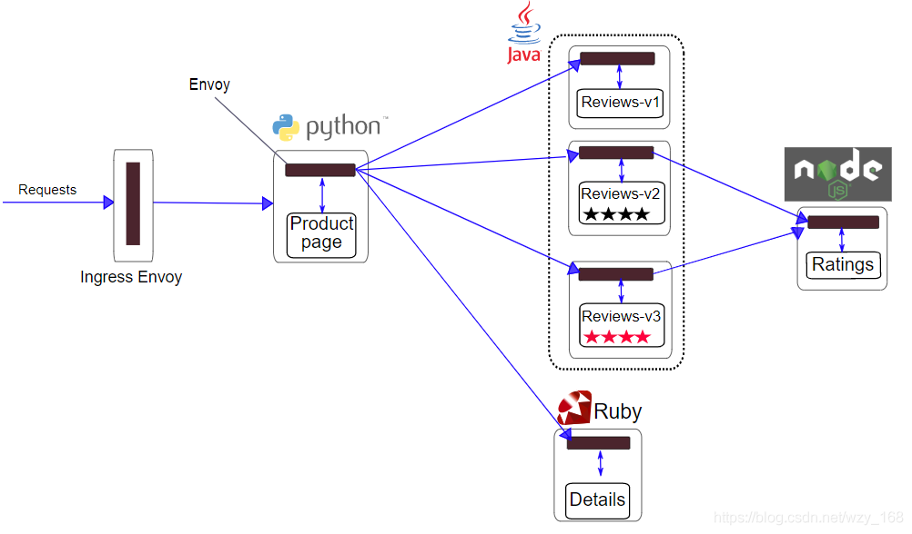

#  1. Improving Performance of Service Mesh for Cloud Native Applications- [Improving Performance of Service Mesh for Cloud Native Applications](#improving-performance-of-service-mesh-for-cloud-native-applications)
  - [Description](#description)
  - [Background Knowledge](#background-knowledge)

# 2. Description
Unlike traditional monolithic applications, cloud-native applications are the 
collection of small and independent services, which are so-called microservices. As cloud-native 
applications have gained tremendous interest in recent years, many cloud vendors such as Google 
Cloud and Amazon Web Service already provided cloud platforms for cloud-native applications.
Service meshes have been considered as a de facto communication subtrate for cloud-native 
applications. Specifcially, each service in a cloud-native application communicate to each other 
via a software proxy, called sidecar. A sidecar intercepts cloud traffic reaching a service and thus 
provides various control functions such as security and traffic management. However, as each 
sidecar is co-located with each service, this design introduces overhead (e.g., increasing latency 
and lower throughput) for cloud-native applications, especially for applications that include a 
significant number of services. This work aims to improve the performance of service mesh for 
cloud-native applications.

# 3. Background Knowledge
## Istio Envoy
Istio uses an extended version of the Envoy proxy. Envoy is a high-performance proxy developed in C++ to mediate all inbound and outbound traffic for all services in the service mesh. Envoy proxies are the only Istio components that interact with data plane traffic.Envoy is a high-performance proxy developed in C++ with built-in service discovery, load balancing, TLS termination, HTTP/2, GRPC proxy, fuse, health check, grayscale publishing based on percentage traffic splitting, fault injection, and more.

We start with a sample tutorial from `bookinfo` to analyze the envoy component.
- Bookinfo application has been successfully deployed and can be accessed via ip and port:
``` bash
$ echo "INGRESS_HOST=$INGRESS_HOST, INGRESS_PORT=$INGRESS_PORT"
INGRESS_HOST=10.0.0.5, INGRESS_PORT=30458
# Here the Ingress gateway uses NodeIP as the gateway

$ curl -s "http://${GATEWAY_URL}/productpage" | grep -o "<title>.*</title>"
<title>Simple Bookstore App</title>
```
The architecture of Bookinfo is as follows:
<div aligh=center></div>

Take Productpage as an example, there are two types of Containers, `Init Containers` and `Contianers`
The `Init container` is a specialized container that runs before the application container starts and is used to contain utilities or installation scripts that do not exist in the application image. Multiple Init containers can be specified in a Pod, and if more than one is specified, then the Init containers will run sequentially. The Init container will automatically terminate when it is finished, and Kubernetes will run the application container only when all Init containers have finished running.

```bash
$ kubectl describe pods productpage-v1-74fdfbd7c7-fpbmd 
# Init Containers
Args:
 istio-iptables
      -p
      15001
      -z
      15006
      -u
      1337
      -m
      REDIRECT
      -i
      *
      -x
      
      -b
      *
      -d
      15090,15021,15020
# Containers
```


